# Vue Education Management System


A modern Vue 3 + TypeScript application for managing educational institution data with role-based access control, analytics dashboards

---

## Table of Contents

1. [Project Overview](#project-overview)
2. [Table of Contents](#table-of-contents)
3. [Demo & Screenshots](#demo--screenshots)
4. [Tech Stack](#tech-stack)
5. [Key Features and User Roles](#key-features-and-user-roles)
6. [Authentication and Authorization](#authentication-and-authorization)
7. [Technical Architecture](#technical-architecture)
8. [API](#8-api)
9. [Project Structure](#project-structure)
10. [TypeScript Configuration](#typescript-configuration)
11. [Quick Start](#quick-start)
12. [Build and Deployment](#build-and-deployment)
13. [Troubleshooting](#troubleshooting)
14. [Contributing](#contributing)
15. [License](#license)

---

## Project Overview

The Vue Education Management System is a frontend application for administering departments, employees, classes, and students. It features role-based access control, analytics dashboards with ECharts visualizations, and a modern UI built with Element Plus.

### Key Highlights

- **Vue 3 Composition API** - All components use `<script setup>` syntax
- **TypeScript** - Full type safety across the application
- **Pinia** - State management with session persistence
- **Element Plus** - Comprehensive UI component library
- **ECharts** - Interactive data visualizations
- **JWT Authentication** - Secure token-based auth with role-based access

**Backend Repository:** [Java Education Management System](https://github.com/clementleetimfu/java-education-management-system)

## Demo & Screenshots

**Video Demo:** [YouTube Video](https://youtu.be/uLk7wINbTYo)

### Login

| Light Mode | Dark Mode |
|------------|-----------|
| 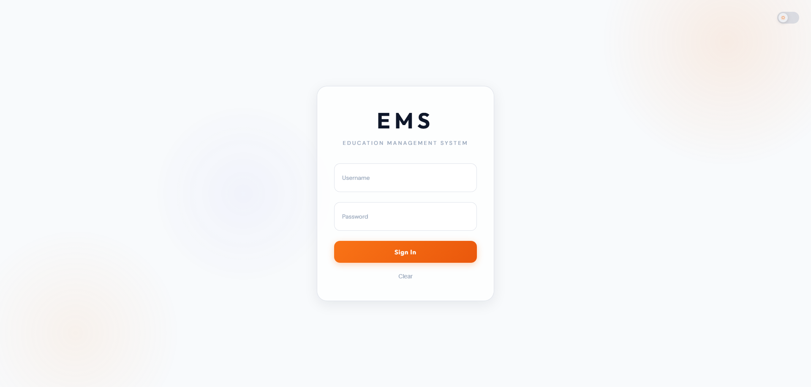 | 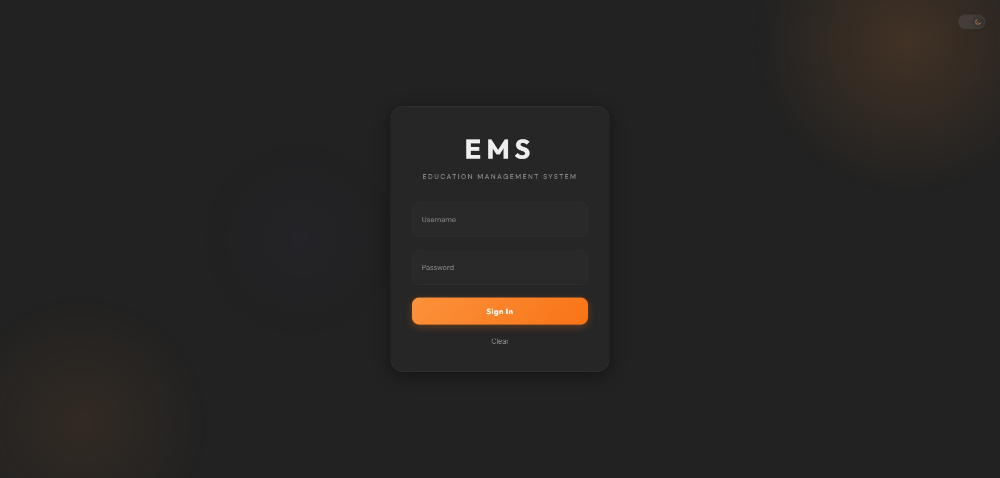 |

### Employee Dashboard

| Light Mode | Dark Mode |
|------------|-----------|
| 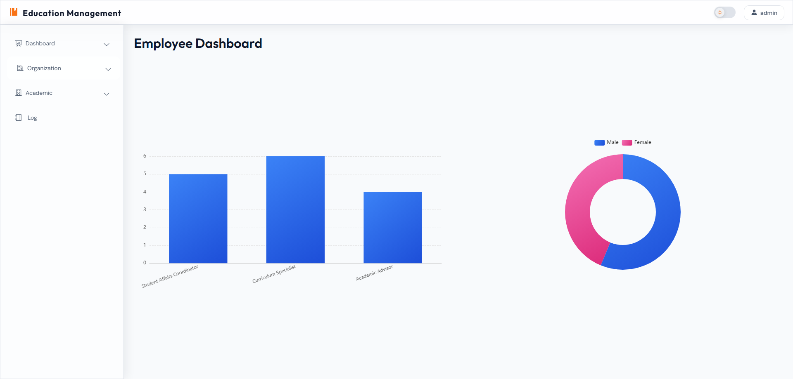 | 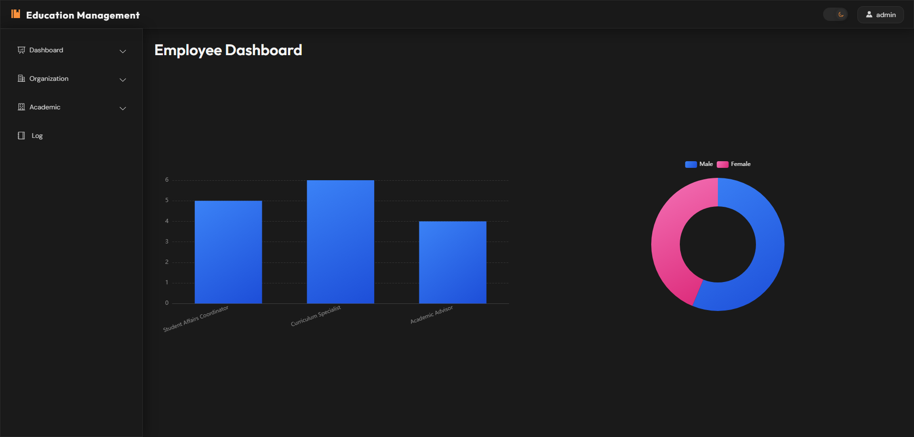 |

### Student Dashboard

| Light Mode | Dark Mode |
|------------|-----------|
| 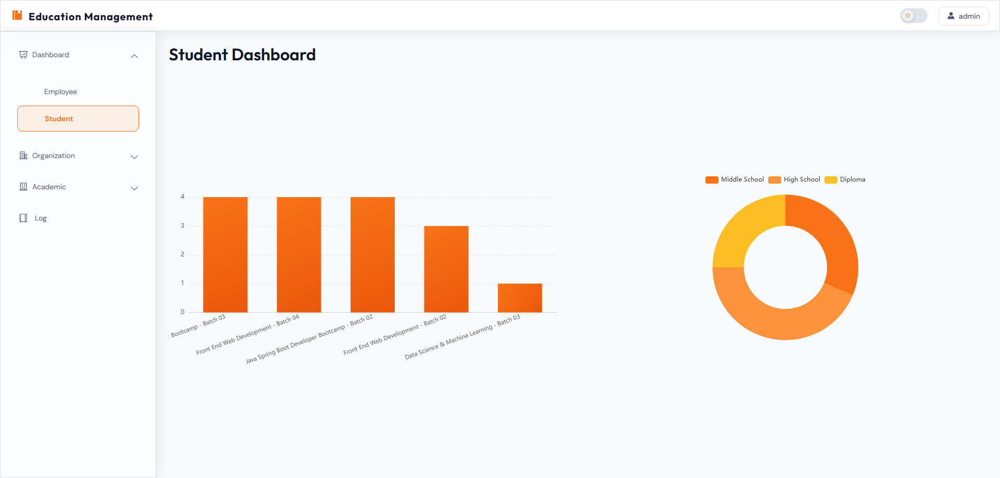 | 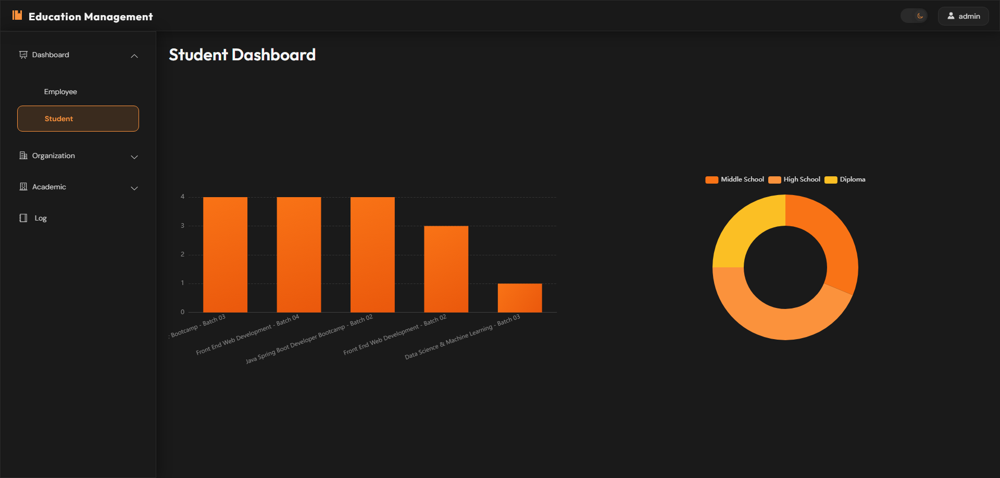 |

### Employee Management

| Light Mode | Dark Mode |
|------------|-----------|
| 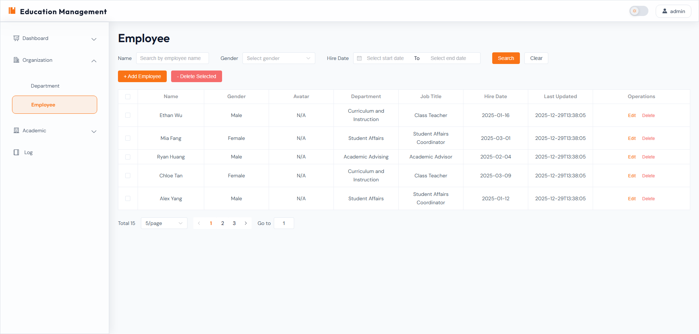 | 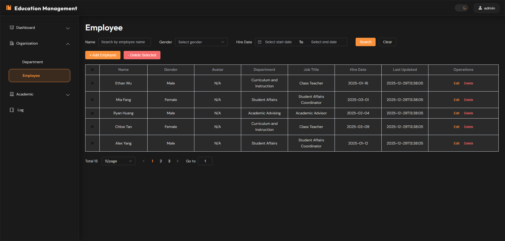 |

### Student Management

| Light Mode | Dark Mode |
|------------|-----------|
| 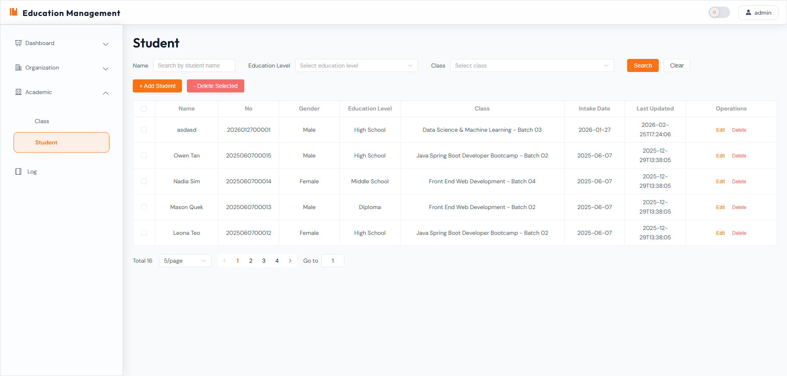 | 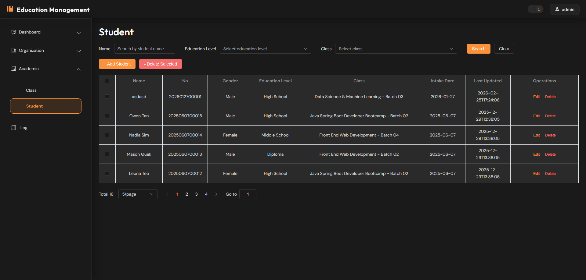 |

### Department Management

| Light Mode | Dark Mode |
|------------|-----------|
| 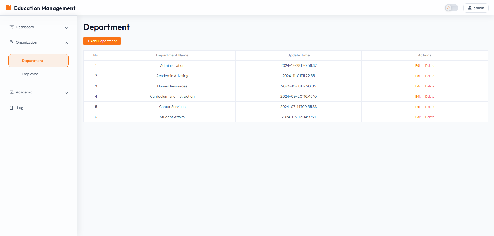 | 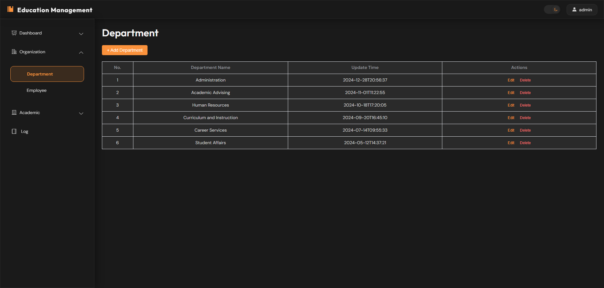 |

### Class Management

| Light Mode | Dark Mode |
|------------|-----------|
| 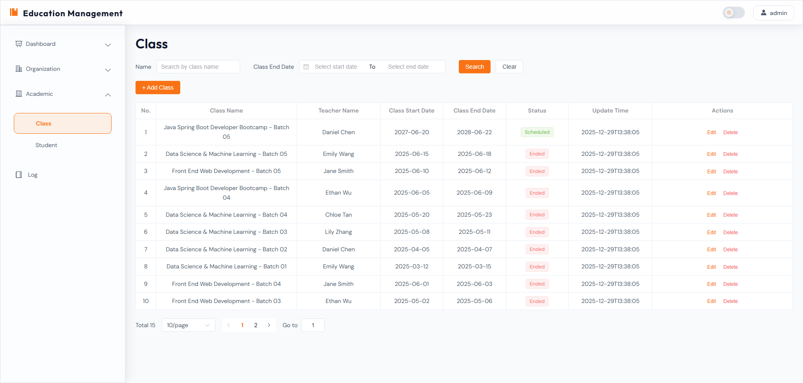 | 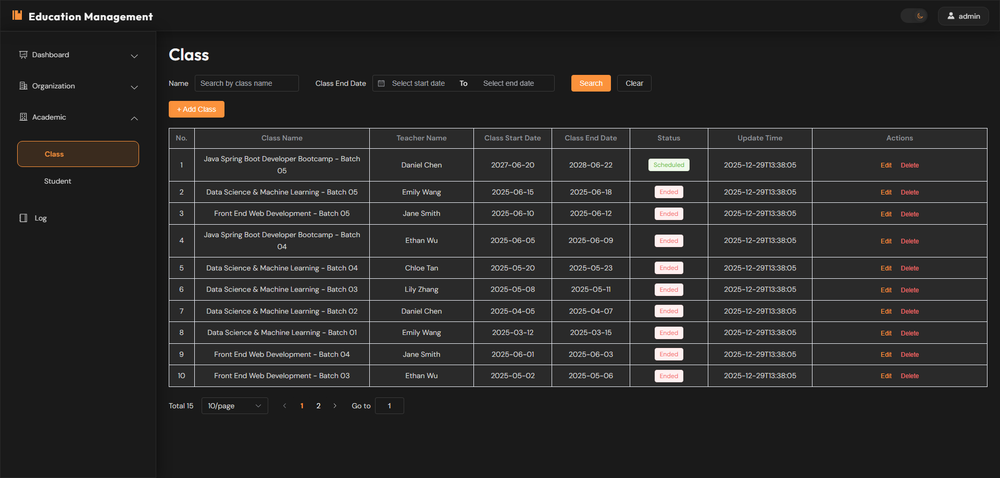 |

### Activity Logs

| Light Mode | Dark Mode |
|------------|-----------|
| 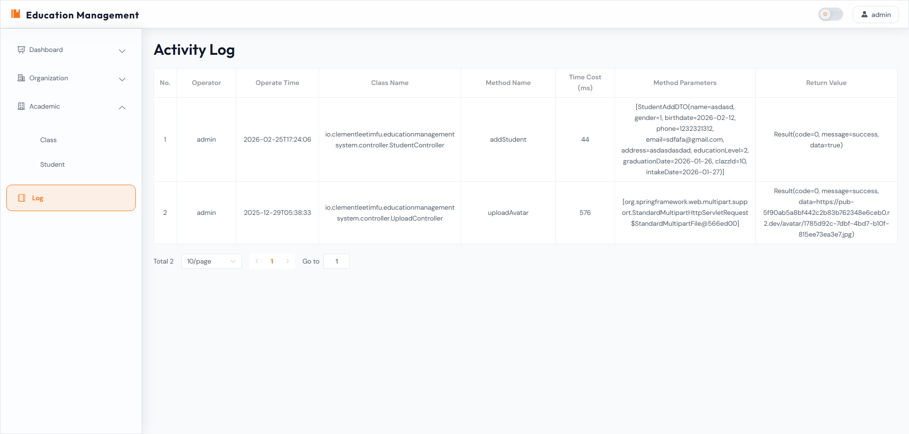 | 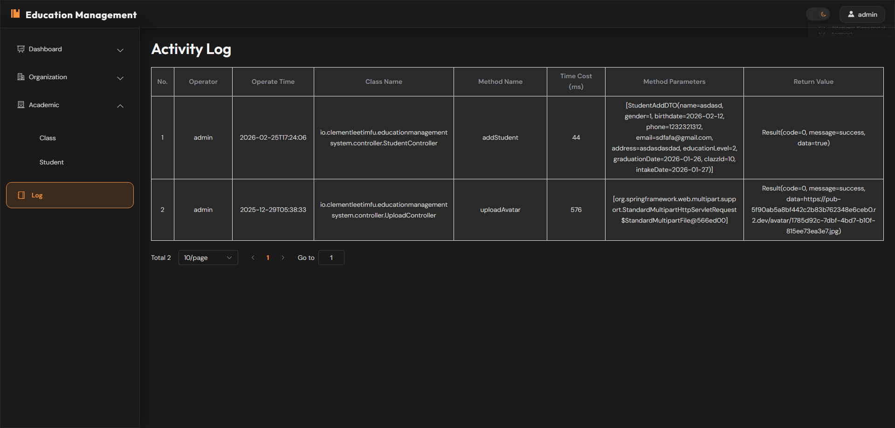 |

---

## Tech Stack

| Technology | Version | Purpose |
|------------|---------|---------|
| [Vue](https://vuejs.org/) | ^3.5.25 | Progressive JavaScript framework |
| [TypeScript](https://www.typescriptlang.org/) | ~5.9.0 | Type-safe JavaScript |
| [Vite](https://vitejs.dev/) | ^7.2.4 | Build tool and dev server |
| [pnpm](https://pnpm.io/) | ^10.0.0 | Fast, disk space efficient package manager |
| [Vue Router](https://router.vuejs.org/) | ^4.6.3 | Official routing library |
| [Pinia](https://pinia.vuejs.org/) | ^3.0.4 | State management |
| [pinia-plugin-persistedstate](https://github.com/prazdevs/pinia-plugin-persistedstate) | ^4.7.1 | State persistence |
| [Element Plus](https://element-plus.org/) | ^2.11.9 | Vue 3 UI framework |
| [Element Plus Icons](https://element-plus.org/en-US/component/icon.html) | ^2.3.2 | Icon set for Element Plus |
| [Axios](https://axios-http.com/) | ^1.13.2 | HTTP client |
| [ECharts](https://echarts.apache.org/) | ^6.0.0 | Data visualization |

---

## Key Features and User Roles

### Features

| Feature | Description |
|---------|-------------|
| **Authentication** | JWT-based login with first-time password reset (min 10 chars) |
| **Dark/Light Theme** | Toggle between dark and light modes with localStorage persistence |
| **Employee Management** | Full CRUD with work experience tracking and search |
| **Student Management** | Complete student records with education levels and class assignment |
| **Department Management** | Organizational structure management |
| **Class Management** | Class scheduling with teacher and subject assignment |
| **Employee Dashboard** | Analytics charts for job title and gender distribution |
| **Student Dashboard** | Analytics charts for class and education level distribution |
| **Activity Logs** | Admin-only access to system activity logs with pagination |

### User Roles

| Role | Permissions |
|------|------------|
| **ROLE_ADMIN** | Full access to all features including activity logs |
| **ROLE_EMPLOYEE** | Access to dashboards, department, employee, class, and student management |

---

## Authentication and Authorization

### Login Flow

```
User enters credentials
        │
        ▼
  POST /auth/login
        │
        ▼
┌───────────────┐     ┌─────────────────────┐
│ isFirstLogged │────▶│ Set new password    │
│ = false      │     │ (min 10 chars)      │
└───────────────┘     └─────────────────────┘
        │
        ▼ true
  Store JWT token in sessionStorage
        │
        ▼
  Parse JWT for username & role
        │
        ▼
  Redirect to dashboard
```

### Password Validation

```typescript
const rules = reactive({
  password: [
    { required: true, message: 'Password is required', trigger: 'blur' },
    { min: 10, message: 'Password length at least 10 characters', trigger: 'blur' }
  ],
  confirmPassword: [
    { required: true, message: 'Confirm password is required', trigger: 'blur' },
    {
      validator: async (_: any, value: string) => {
        if (value !== dialogFormInput.password) {
          throw new Error('Passwords do not match')
        }
      },
      trigger: 'change'
    }
  ]
})
```

### Route Guards

The router implements navigation guards:

```typescript
router.beforeEach((to, from, next) => {
  const disabledFlag = ref<boolean>(isDisabled());
  const isLoggedIn = !!sessionStorage.getItem('token')

  if (to.meta.requiresAuth && !isLoggedIn) {
    next({ path: '/login', query: { redirect: to.fullPath } })
  }

  if (to.meta.requiresAdmin && disabledFlag.value) {
    return next({ path: '/' });
  }

  next()
})
```

## Route Table

> **Note:** Routes from `/dash-emp` through `/log` are nested as children of the `/` Layout route. The Layout component provides the sidebar and navigation wrapper.

| Path | Component | Auth Required | Admin Required |
|------|-----------|---------------|----------------|
| `/` | Layout (redirects to `/dash-emp`) | No | No |
| `/login` | Login | No | No |
| `/dash-emp` | Employee Dashboard | Yes | No |
| `/dash-student` | Student Dashboard | Yes | No |
| `/dept` | Department | Yes | No |
| `/emp` | Employee | Yes | No |
| `/clazz` | Class | Yes | No |
| `/stud` | Student | Yes | No |
| `/log` | Activity Log | Yes | Yes |


## Technical Architecture

### State Management (Pinia)

**Employee Store:** `src/stores/emp.ts`
```typescript
export const useEmployeeStore = defineStore('employee', {
  state: () => ({
    id: null as number | null,
    username: '' as string,
    roleName: '' as string,
  }),
  actions: {
    setUsername(name: string) { this.username = name },
    setId(id: number | null) { this.id = id },
    setRoleName(roleName: string) { this.roleName = roleName },
  },
  persist: { storage: sessionStorage },
})
```

**Theme Store:** `src/stores/theme.ts`
```typescript
export const useThemeStore = defineStore('theme', () => {
  const isDark = ref<boolean>(false);

  const initTheme = () => {
    const saved = localStorage.getItem('theme');
    if (saved) {
      isDark.value = saved === 'dark';
    } else {
      isDark.value = false;
    }
    applyTheme();
  };

  const applyTheme = () => {
    document.documentElement.classList.remove('light', 'dark');
    document.documentElement.classList.add(isDark.value ? 'dark' : 'light');
  };

  const toggleTheme = () => {
    isDark.value = !isDark.value;
    localStorage.setItem('theme', isDark.value ? 'dark' : 'light');
    applyTheme();
  };

  watch(isDark, applyTheme);

  return {
    isDark,
    initTheme,
    toggleTheme,
  };
});
```

### Error Handling

All async functions use try-catch with ElMessage feedback:

```typescript
const handleSubmit = async (): Promise<void> => {
  try {
    const result = await apiCall(data)
    if (result?.code === 0 && result?.data) {
      ElMessage.success('Operation successful')
    } else {
      ElMessage.error(result?.message || 'Operation failed')
    }
  } catch (error: any) {
    ElMessage.error('An unexpected error occurred')
  }
}
```

### Common Error Codes

| Code | Meaning | Action |
|------|---------|--------|
| `0` | Success | Process data |
| `1` | Business error | Show message |
| `401` | Unauthorized | Redirect to login |
| `403` | Forbidden | Show access denied |
| `500` | Server error | Show generic error |

---

## API

### HTTP Client Configuration

**Location:** `src/utils/request.ts`

- **Base URL:** `/api` (proxied to `http://localhost:8080` in dev)
- **Timeout:** 10000ms
- **Request Interceptor:** Automatically adds Bearer token
- **Response Interceptor:** Handles 401 errors with redirect to login

```typescript
// Request Interceptor - Adds JWT token
request.interceptors.request.use(
  (config) => {
    config.headers.Authorization = 'Bearer ' + sessionStorage.getItem('token')
    return config
  },
  (error) => Promise.reject(error)
)

// Response Interceptor - Handles errors
request.interceptors.response.use(
  (response) => response.data,
  (error) => {
    if (error.response?.status === 401) {
      router.push('/login')
      ElMessage.error('Session expired. Please login again')
    }
    return Promise.reject(error)
  }
)
```

### Response Format

```typescript
interface ApiResponse<T> {
  code: number        // 0 = success, 1 = error
  message: string     // Response message
  data: T            // Response data
}

interface PageResult<T> {
  total: number
  rows: T[]
}

interface Page {
  page: number
  pageSize: number
}
```

### API Endpoints

| Module | Endpoints |
|--------|-----------|
| **Auth** | `POST /auth/login`, `POST /auth/update-password`, `POST /auth/logout` |
| **Employees** | `GET /emps/search`, `GET /emps/{id}`, `POST /emps`, `PUT /emps`, `DELETE /emps?ids=...`, `GET /emps/teachers` |
| **Students** | `GET /students/search`, `GET /students/{id}`, `POST /students`, `PUT /students`, `DELETE /students?ids=...` |
| **Departments** | `GET /depts`, `POST /depts`, `PUT /depts`, `DELETE /depts/{id}` |
| **Classes** | `GET /clazz/search`, `GET /clazz`, `GET /clazz/{id}`, `POST /clazz`, `PUT /clazz`, `DELETE /clazz/{id}` |
| **Dashboard** | `GET /emps/jobTitle/count`, `GET /emps/gender/count`, `GET /students/clazz/count`, `GET /students/edu-level/count` |
| **Logs** | `GET /logs` |
| **Reference** | `GET /edu-levels`, `GET /jobs`, `GET /subjects` |

> **Note:** Delete endpoints for Employees and Students use query parameters for batch deletion: `DELETE /emps?ids=1,2,3` and `DELETE /students?ids=1,2,3`

### ECharts Theme Utility

**Location:** `src/utils/chartTheme.ts`

Provides theme-aware ECharts configurations that automatically adapt to the dark/light theme:

```typescript
import { getBarChartOption, getPieChartOption } from '@/utils/chartTheme'

// Theme-aware bar chart
const option = getBarChartOption(
  xData,
  yData,
  ['#409EFF', '#67C23A']  // gradient colors
)

// Theme-aware pie chart
const option = getPieChartOption([
  { value: 10, name: 'Category A' },
  { value: 20, name: 'Category B' }
])
```

The utility automatically adjusts chart colors based on the current theme:
- **Light mode**: Dark text, light grid lines, white tooltips
- **Dark mode**: Light text, dark grid lines, dark tooltips
---

## Project Structure

```
vue-education-management-system/
├── public/
│   └── favicon.ico
├── src/
│   ├── api/              # API service layer
│   │   ├── auth.ts       # Authentication endpoints
│   │   ├── common.ts     # Shared types (ApiResponse, PageResult, Page)
│   │   ├── emp.ts        # Employee management endpoints
│   │   ├── empDash.ts    # Employee dashboard analytics
│   │   ├── student.ts    # Student management endpoints
│   │   ├── studentDash.ts # Student dashboard analytics
│   │   ├── dept.ts       # Department management endpoints
│   │   ├── clazz.ts      # Class management endpoints
│   │   ├── log.ts        # Activity log endpoints
│   │   ├── eduLevel.ts   # Reference data - education levels
│   │   ├── subject.ts    # Reference data - subjects
│   │   └── jobs.ts      # Reference data - job titles
│   ├── assets/           # CSS, images
│   ├── components/       # Reusable components
│   │   └── ThemeToggle.vue # Dark/light theme toggle button
│   ├── constants/        # Constants
│   │   └── role.ts       # Role enum (ROLE_ADMIN, ROLE_EMPLOYEE)
│   ├── router/           # Route configuration & guards
│   │   └── index.ts      # Vue Router setup
│   ├── stores/           # Pinia stores
│   │   ├── emp.ts        # Employee store (sessionStorage persistence)
│   │   └── theme.ts      # Theme store (localStorage persistence)
│   ├── utils/            # Utilities
│   │   ├── request.ts    # Axios HTTP client configuration
│   │   ├── permission.ts # Permission helpers (isDisabled)
│   │   └── chartTheme.ts # ECharts theme configurations
│   ├── views/            # Page components
│   │   ├── clazz/        # Class management
│   │   ├── dashboard/    # Dashboards (employee & student)
│   │   ├── department/   # Department management
│   │   ├── employee/     # Employee management
│   │   ├── layout/       # Main layout with sidebar
│   │   ├── log/          # Activity logs
│   │   ├── login/        # Login page
│   │   └── student/      # Student management
│   ├── App.vue
│   └── main.ts
├── .vscode/
├── vite.config.ts
├── tsconfig.json         # Project references configuration
├── tsconfig.app.json     # App TypeScript config
├── tsconfig.node.json    # Build tools TypeScript config
├── package.json
├── pnpm-lock.yaml         # pnpm lockfile
```

---

## TypeScript Configuration

The project uses a **project references** approach to separate app and build-tool configurations:

### Configuration Files

| File | Purpose |
|------|---------|
| `tsconfig.json` | Root configuration with project references | 
| `tsconfig.app.json` | Application code TypeScript configuration |
| `tsconfig.node.json` | Build tools (Vite) TypeScript configuration |

### App Configuration (`tsconfig.app.json`)

```json
{
  "extends": "@vue/tsconfig/tsconfig.dom.json",
  "include": ["env.d.ts", "src/**/*", "src/**/*.vue"],
  "exclude": ["src/**/__tests__/*"],
  "compilerOptions": {
    "paths": { "@/*": ["./src/*"] }
  }
}
```

- Extends Vue's DOM TypeScript configuration
- Includes all Vue and TypeScript files in `src/`
- Configures `@/` alias for `src/` imports
- Excludes test files from type checking

### Node Configuration (`tsconfig.node.json`)

```json
{
  "extends": "@tsconfig/node24/tsconfig.json",
  "include": ["vite.config.*"],
  "compilerOptions": {
    "noEmit": true,
    "module": "ESNext",
    "moduleResolution": "Bundler",
    "types": ["node"]
  }
}
```

- For Vite configuration files
- Uses Node.js TypeScript configuration
- Bundler resolution for import behavior

---


## Quick Start

### Prerequisites

- **Node.js:** `^20.19.0` or `>=22.12.0`
- **pnpm:** `^10.0.0` (or enable corepack with `corepack enable`)
- **Backend API:** Running at `http://localhost:8080`

### Installation

```bash
git clone <repository-url>
cd vue-education-management-system
pnpm install
```

### Available Scripts

| Script | Description |
|--------|-------------|
| `pnpm dev` | Start development server (http://localhost:5173) |
| `pnpm build` | Type check and build for production |
| `pnpm build-only` | Build only (skip type-check) |
| `pnpm preview` | Preview production build |
| `pnpm type-check` | Run vue-tsc type checking |

---

## Build and Deployment

### Build Configuration

**Location:** `vite.config.ts`

```typescript
export default defineConfig({
  plugins: [vue(), vueDevTools()],
  resolve: { alias: { '@': fileURLToPath(new URL('./src', import.meta.url)) } },
  server: {
    proxy: {
      '/api': {
        target: 'http://localhost:8080',
        changeOrigin: true,
        rewrite: (path) => path.replace(/^\/api/, '')
      }
    }
  }
})
```

### Application Bootstrap

**Location:** `src/main.ts`

```typescript
import { createApp } from 'vue'
import App from './App.vue'
import ElementPlus from 'element-plus'
import 'element-plus/dist/index.css'
import * as ElementPlusIconsVue from '@element-plus/icons-vue'
import { createPinia } from 'pinia'
import piniaPluginPersistedstate from 'pinia-plugin-persistedstate'
import router from './router'
import './assets/main.css'

const pinia = createPinia()
pinia.use(piniaPluginPersistedstate)

const app = createApp(App)

app.use(pinia)
app.use(router)
app.use(ElementPlus)

// Register all Element Plus icons globally
for (const [key, component] of Object.entries(ElementPlusIconsVue)) {
  app.component(key, component)
}

app.mount('#app')
```

All Element Plus icons are **globally registered** and can be used directly in components:

```vue
<template>
  <el-icon><User /></el-icon>
  <el-icon><Setting /></el-icon>
</template>
```

### Production Build

```bash
pnpm build
```

Output: `dist/` directory with static files
---

## Troubleshooting

| Issue | Solution |
|-------|----------|
| **CORS errors** | Ensure backend runs on localhost:8080 |
| **401 after login** | Clear sessionStorage and re-login |
| **Theme not persisting** | Check localStorage theme key |
| **TypeScript errors** | Run `pnpm type-check` |
| **Port 5173 in use** | Stop other processes or change port |

### Debugging Tips

- **Vue DevTools** - Component inspection
- **Network Tab** - Debug API calls
- **Console** - Check runtime errors

---

## Contributing

1. Fork the repository
2. Create feature branch: `git checkout -b feature/xxx`
3. Install dependencies: `pnpm install`
4. Run development: `pnpm dev`
5. Type-check before committing: `pnpm type-check`
6. Submit pull request

### Code Standards

- Use Composition API with `<script setup lang="ts">`
- Define TypeScript interfaces for all data models
- Use try-catch for async operations
- Follow naming conventions (camelCase, PascalCase)

---

## License

This project is licensed under the **MIT License**. See the [LICENSE](LICENSE) file for details.
